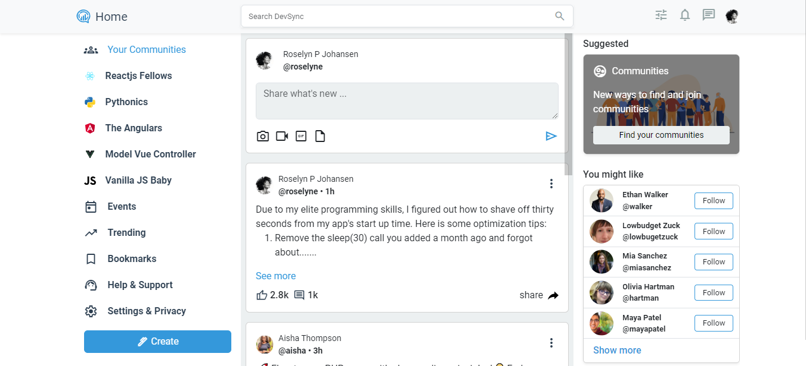

 <h1> DevSync</h1>

## Overview

DevSync is a collaborative platform for developers to connect, share insights, and foster innovation. Whether you're a coding enthusiast, a seasoned professional, or just starting your coding journey, DevSync is your go-to space for building, learning, and collaborating.

## Features

- **Connect with Developers:** Create a profile, connect with other developers, and build a network of like-minded coding enthusiasts.
- **Community Forums:** Engage in discussions, ask questions, and share your expertise in our vibrant community forums.
- **Project Collaboration:** Find collaborators for your projects or join existing ones. Share code, work on projects together, and boost productivity.
- **Event Calendar:** Stay updated on coding events, webinars, and hackathons. Plan and organize events within the DevSync community.
- **Resource Sharing:** Discover and share coding resources, tutorials, and best practices with the community.

## Getting Started

Follow these steps to get started with DevSync:

1. **Installation:** Clone the repository and install dependencies using `npm install`.

2. **Setup:** Configure your scripts to compile css in `package.json`.

3. **Run the App:** Start the application using `your script`.

## Tech Stack

- HTML
- CSS
- BOOTSTRAP
- SASS
- MATERIAL DESIGN ICONS

## Contributing

We welcome contributions from the community!  to get started.

 
## Contact

For inquiries, reach out to [roselynepj1@gmail.com].

Happy coding!

